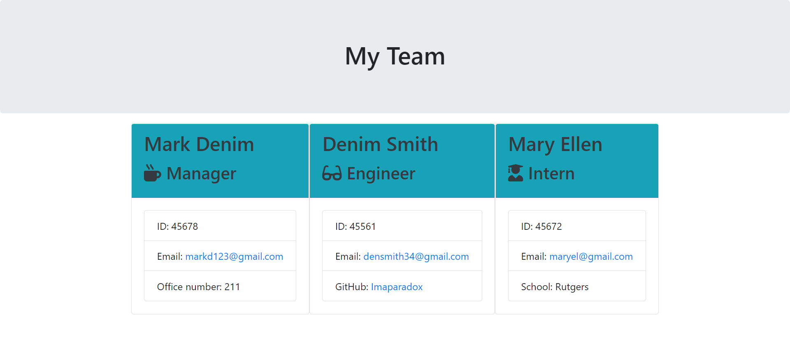

# Team Profile Generator SMM

This project is a homework assignment for Rutgers Coding Bootcamp.

## Description
This is a command-line application that accepts the user's input. The user is prompted for their team members and their information, which then generates an HTML that displays a formatted team roster based on the user's input. When the user clicks on an email address in the HTML, their default email program opens and populates the TO field of the email with the address.The user can also click on the GitHub username, which brings the user to the clicked GitHub profile within a new tab. 

To start the application, the user is prompted to enter the team manager's name, ID, email, and office number. The user is then presented with a menu with the option to add an engineer, or an intern, or to finish building their team. The user can either select engineer with prompts for their name, ID, email, and GitHub username, or they can select intern with prompts for their name, ID, email, and school. After answering all the prompts the user is taken back to the menu. Finally, when the user decides to finish building their team, they can exit the application, and the HTML is generated.

## Table of Contents 

* [Deploy](#deploy)
* [Technologies Used](#technologies-used)
* [Usage](#usage)
* [Notes](#notes)
* [Contributions](#contributions)
* [Licenses](#licenses)

## Deploy

This webpage is generated via the command-line based on user inputs.

## Technologies Used

* HTML
* JavaScript
* Bootstrap
* Node.js
* Jest

## Usage 

### Full Page

### Demo
[video demo link] https://drive.google.com/file/d/1pszDjkGZmyHUcJoEzB580KoCTcOFjwCz/view

## Notes
This projects used OOP and TDD to develop this web application. Each test passed successful to ensure a smooth user experience. Looking forward to using these methods for future development.

## Contributions
N/A

## Licenses
N/A
